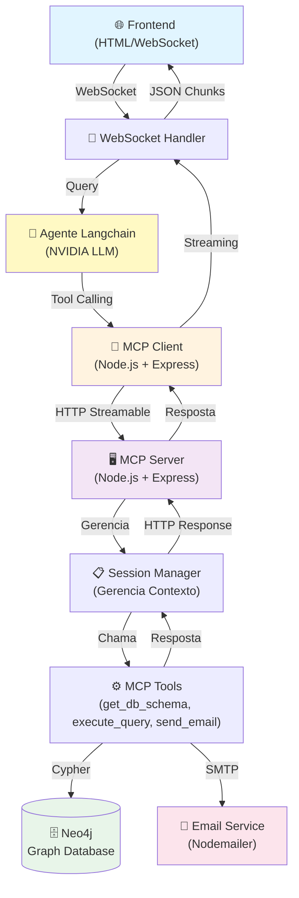

# QueryMCP 🤖⛏️

Plataforma de chatbot para exposição de um agente de IA que consome ferramentas via MCP, integrando cliente, servidor e LLM em uma arquitetura local.


<div align="center">
	<a href="#visao-geral">Visão Geral</a> •
	<a href="#recursos-principais">Recursos Principais</a> •
	<a href="#ferramentas">APIs e Ferramentas</a> •
    <a href="#tecnologias">Tecnologias</a> •
    <a href="#estrutura-do-projeto">Estrutura do Projeto</a> •
	<a href="#arquitetura">Arquitetura</a> •
	<a href="#llm">LLM</a> •
    <a href="#principios-solid-aplicados">Princípios SOLID Aplicados</a> •
	<a href="#fluxos-rag">Fluxos RAG</a> •
	<a href="#infraestrutura-local">Infraestrutura Local</a> •
	<a href="#instalacao-e-uso">Instalação e Uso</a> •
	<a href="#configuracao-de-ambiente">Configuração de Ambiente</a> •
	<a href="#debitos-tecnicos-e-melhorias">Débitos Técnicos e Melhorias</a> •
	<a href="#contribuicao">Contribuição</a>
</div>

---

## 📋 Visão Geral

<a id="visao-geral"></a>

O QueryMCP conecta um chatbot a um agente de IA capaz de consumir ferramentas via MCP, simplificando consultas, automações e exploração de dados em uma interface conversacional.

O projeto é dividido em dois componentes principais:

- **MCP Server**: Servidor que expõe ferramentas para interagir com um banco de dados Neo4j, enviar e-mails e gerenciar sessões de contexto
- **MCP Client**: Cliente que consome as ferramentas disponibilizadas pelo servidor e as integra com um agente Langchain, comunicando-se via WebSocket com um frontend

> ℹ️ Esta implementação segue a especificação **Streamable HTTP** do Model Context Protocol. Para mais detalhes, consulte: https://modelcontextprotocol.io/specification/2025-03-26/basic/transports

---

## 🚀 Recursos Principais

<a id="recursos-principais"></a>

- ✅ **Servidor MCP com Transporte HTTP Streamable**: Implementação completa da especificação MCP para comunicação entre clientes e servidores
- ✅ **Gerenciamento de Sessões**: Cada cliente mantém uma sessão isolada com o servidor MCP
- ✅ **Tool Calling com LLM**: Integração com modelos de IA que suportam chamada de ferramentas
- ✅ **Banco de Dados Neo4j**: Armazenamento gráfico de dados com suporte a queries customizadas
- ✅ **Comunicação WebSocket**: Streaming de respostas em tempo real ao frontend
- ✅ **Validação de Entrada**: Validação de schemas usando Zod
- ✅ **Sistema de E-mails**: Integração com Nodemailer para envio de mensagens
- ✅ **Containerização Docker**: Stack completo pré-configurado com Docker Compose

---

## ⛏️ APIs e Ferramentas

### WebSocket Client API

O cliente envia e recebe mensagens via WebSocket:

**Mensagem de Entrada:**
```json
{
	"type": "query",
	"content": "Qual é o schema do banco de dados?"
}
```

**Mensagens de Saída:**
```json
{
	"type": "chunk",
	"content": "Parte da resposta..."
}
```

```json
{
	"type": "end"
}
```

```json
{
	"type": "error",
	"message": "Descrição do erro"
}
```

### MCP Server HTTP Routes

O servidor MCP expõe as seguintes rotas HTTP para comunicação com clientes MCP:

#### POST `{MCP_SERVER_ENDPOINT}`

Processa requisições MCP e executa as ferramentas solicitadas.

**Middleware:**
- `extractSessionId` - Extrai o ID da sessão da requisição (opcional)

**Mensagem de Entrada:**
```json
{
  "jsonrpc": "2.0",
  "id": "1",
  "method": "tools/call",
  "params": {
    "name": "query_database",
    "arguments": {
      "sql": "SELECT * FROM users LIMIT 5"
    }
  }
}
```

**Mensagens de Saída (Content-Type JSON ou Event Stream):**
```json
{
  "jsonrpc": "2.0",
  "id": "1",
  "result": {
    "content": [
      {
        "type": "text",
        "text": "[{\"id\": 1, \"name\": \"Alice\"}, {\"id\": 2, \"name\": \"Bob\"}]"
      }
    ],
    "isError": false
  }
}
```

#### GET `{MCP_SERVER_ENDPOINT}`

Para envio de solicitações ou atualizações espontâneas ao cliente sem esperar por um novo POST.

**Middleware:**
- `extractSessionId` - Extrai o ID da sessão (obrigatório)
- `requireSessionId` - Valida que o ID da sessão foi fornecido (obrigatório)

**Mensagens de Saída (Content-Type Event Stream):**
```json
{
    "jsonrpc":"2.0",
    "method":"notifications/initialized"
}
```

### MCP Server Tools

<a id="ferramentas"></a>

O servidor MCP expõe as seguintes ferramentas:

#### 1. `get_db_schema`

Retorna o schema completo do banco de dados Neo4j.

```typescript
{
	description: "Retorna o schema do banco de dados"
}
```

**Exemplo de Resposta:**
```json
{
	"nodes": [...],
	"relationships": [...],
	"indexes": [...]
}
```

#### 2. `execute_query`

Executa uma query no banco de dados com suporte a parâmetros.

```typescript
{
	description: "Executa uma query no banco de dados",
	inputs: {
		query: "string (obrigatório) - A query Cypher a executar",
		params: "object (opcional) - Parâmetros para a query"
	}
}
```

**Exemplo de Uso:**
```json
{
	"query": "MATCH (n:User {email: $email}) RETURN n LIMIT 10",
	"params": { "email": "user@example.com" }
}
```

#### 3. `send_email`

Envia um e-mail através do servidor de e-mails configurado.

```typescript
{
	description: "Envia um e-mail",
	inputs: {
		to: "string | string[] - Destinatários do e-mail",
		subject: "string - Assunto do e-mail",
		body: "string - Corpo do e-mail"
	}
}
```

**Exemplo de Uso:**
```json
{
	"to": ["user@example.com", "admin@example.com"],
	"subject": "Notificação de Sistema",
	"body": "Mensagem do seu sistema automático"
}
```

---

## 🛠️ Tecnologias

<a id="tecnologias"></a>

### Backend - MCP Server
- **Node.js** - Runtime JavaScript
- **Express** `^5.2.1` - Framework web
- **@modelcontextprotocol/sdk** `^1.28.0` - SDK do protocolo MCP
- **Neo4j Driver** `^6.0.1` - Driver para banco de dados Neo4j
- **Nodemailer** `^8.0.7` - Biblioteca de envio de e-mails
- **Dotenv** `^17.3.1` - Gerenciamento de variáveis de ambiente
- **Zod** - Validação de schemas

### Backend - MCP Client
- **Node.js** - Runtime JavaScript
- **Express** `^5.2.1` - Framework web
- **WebSocket (ws)** `^8.20.0` - Comunicação em tempo real
- **@modelcontextprotocol/sdk** `^1.29.0` - SDK do protocolo MCP
- **Langchain** `^1.2.38` - Framework para aplicações com LLM
- **@langchain/openai** `^1.4.5` - Integração com modelos OpenAI-compatíveis, incluindo endpoints externos

### Infraestrutura
- **Docker** - Containerização
- **Docker Compose** - Orquestração de containers
- **Neo4j** `5.x` - Banco de dados gráfico
- **MailDev** - Servidor SMTP local para testes

### Linguagem & Ferramentas
- **TypeScript** `^6.0.2` - Tipagem estática
- **tsx / ts-node-dev** - Execução de TypeScript em desenvolvimento

---

## 🤖 LLM

<a id="llm"></a>

O projeto utiliza LLMs disponibilizados gratuitamente pela **NVIDIA** com suporte a **tool calling**, neste caso, o modelo **GLM4-7**.

Mesmo que os modelos não pertencem à OpenAI, o cliente LangChain utilizado aqui é o pacote **@langchain/openai** porque ele implementa uma interface para APIs no formato OpenAI-compatible. Na prática, isso permite reaproveitar a classe `ChatOpenAI` com uma `baseURL` personalizada apontando para a NVIDIA, sem alterar o restante da cadeia de orquestração.


> ℹ️ Referências: 
> - https://docs.api.nvidia.com/nim/reference/z-ai-glm4-7
> - https://medium.com/coding-nexus/nvidia-is-offering-80-ai-models-for-free-via-apis-fc64b38276b8

---

## 📁 Estrutura do Projeto

<a id="estrutura-do-projeto"></a>

```
QueryMCP/
├── backend/
│   ├── mcp-server/                    # Servidor MCP
│   │   ├── src/
│   │   │   ├── index.ts               # Ponto de entrada
│   │   │   ├── config/
│   │   │   │   └── env-config.ts      # Validação de variáveis de ambiente
│   │   │   ├── tools/
│   │   │   │   └── mcp-tools.ts       # Definição das ferramentas MCP
│   │   │   └── infrastructure/
│   │   │       ├── input/
│   │   │       │   └── http/          # Controllers, rotas, middleware, sessões
│   │   │       ├── output/
│   │   │       │   ├── email/         # Clientes de e-mail
│   │   │       │   ├── mcp/           # Transporte HTTP Streamable
│   │   │       │   └── repository/    # Acesso a dados (Neo4j)
│   │   │       └── types/
│   │   ├── docker/
│   │   │   └── Dockerfile
│   │   ├── package.json
│   │   └── tsconfig.json
│   │
│   └── mcp-client/                    # Cliente MCP
│       ├── src/
│       │   ├── index.ts               # Ponto de entrada
│       │   ├── config/
│       │   │   └── env-config.ts      # Validação de variáveis de ambiente
│       │   ├── infrastructure/
│       │   │   ├── input/
│       │   │   │   └── websocket/     # Handlers de WebSocket
│       │   │   └── output/
│       │   │       ├── langchain/     # Integração com Langchain
│       │   │       └── mcp/           # Cliente MCP
│       │   └── types/
│       ├── docker/
│       │   └── Dockerfile
│       ├── package.json
│       └── tsconfig.json
│
├── docker/
│   ├── docker-compose.yaml            # Orquestração de serviços
│   ├── env-example                    # Variáveis de exemplo
│   └── scripts/
│       ├── init-neo4j.sh              # Script de inicialização Neo4j
│       └── init-neo4j.cypher          # Queries de setup
│
├── frontend/
│   └── index.html                     # Interface web
│
├── LICENSE
└── README.md
```

---

## 🏗️ Arquitetura

<a id="arquitetura"></a>



### Fluxo de Requisição

1. **Frontend** envia uma pergunta via WebSocket para o **MCP Client**
2. **MCP Client** recebe a query e a passa para o agente **Langchain**
3. **Langchain + LLM** analisa a pergunta e decide quais **ferramentas MCP** utilizar
4. **MCP Client** faz requisições **HTTP Streamable** para o **MCP Server**
5. **MCP Server** gerencia uma **sessão isolada** para o cliente
6. As **ferramentas registradas** são executadas (queries no Neo4j, envio de e-mails, etc.)
7. Os **resultados** são retornados ao **Langchain**, que formata a resposta final
8. A resposta é **streamada via WebSocket** em chunks para o frontend

---

## 🎯 Princípios SOLID Aplicados

<a id="principios-solid-aplicados"></a>

### **S** - Single Responsibility Principle

Cada classe possui uma única responsabilidade bem definida:
- `MCPController` → Handles HTTP requests
- `MCPSessionManager` → Gerencia sessões
- `Neo4jRepository` → Acesso a dados
- `NodeMailerClient` → Envio de e-mails
- `WebSocketHandler` → Comunicação WebSocket

### **O** - Open/Closed Principle

O código é aberto para extensão mas fechado para modificação:
- Novas ferramentas podem ser registradas sem modificar `MCPSessionManager`
- Novos clients podem ser adicionados ao sistema sem alterar a arquitetura core
- Interfaces abstratas (`DbRepository`, `EmailClient`) permitem múltiplas implementações

### **L** - Liskov Substitution Principle

Implementações de interfaces podem ser substituídas sem quebrar o sistema:
- `Neo4jRepository` implementa `DbRepository` de forma intercambiável
- `NodeMailerClient` implementa `EmailClient`
- Novos transportes MCP podem substituir o HTTP Streamable

### **I** - Interface Segregation Principle

Interfaces são específicas e não forçam dependências desnecessárias:
- `EmailClient` possui apenas métodos de e-mail
- `DbRepository` possui apenas métodos de acesso a dados

### **D** - Dependency Inversion Principle

Classes de alto nível não dependem de implementações concretas:
- `MCPSessionManager` depende de abstrações (`DbRepository`, `EmailClient`)

---

## 🔄 Fluxos RAG

<a id="fluxos-rag"></a>

### O que é RAG?

**RAG (Retrieval-Augmented Generation)** combina busca de informações com geração de texto. Neste projeto, implementamos RAG através do seguinte fluxo:

### Fluxo RAG Implementado

#### 1️⃣ **Recuperação (Retrieval)**

```
Pergunta do Usuário
		↓
[Langchain Agent]
		↓
Decide: "Preciso do schema do banco de dados?"
		↓
[MCP Client] → [MCP Server]
		↓
execute_query("CALL db.schema.visualization()")
		↓
[Neo4j Driver] ← Retorna schema completo
```

#### 2️⃣ **Enriquecimento de Contexto**

```
[Schema Recuperado] + [Pergunta Original]
		↓
[Langchain] constrói o contexto
		↓
LLM agora tem conhecimento estruturado do banco
```

#### 3️⃣ **Geração de Resposta (Generation)**

```
[LLM + Contexto do Neo4j]
		↓
Gera queries ou respostas informadas
		↓
Pode executar mais queries para refinar
		↓
[Response Streaming] via WebSocket
```

### Exemplo de RAG em Ação

**Pergunta:** "Quantos usuários temos e qual é o e-mail do usuário mais antigo?"

1. Agent analisa a pergunta
2. Chama `get_db_schema` para entender a estrutura
3. Chama `execute_query` com Cypher para buscar dados
4. Recebe resultados do Neo4j
5. LLM formata a resposta natural em português
6. Resposta é streamada ao usuário

---

## 🐳 Infraestrutura Local

<a id="infraestrutura-local"></a>

### Serviços Docker Compose

O projeto inclui um `docker-compose.yaml` que orquestra:

| Serviço | Container | Descrição |
|---------|-----------|-----------|
| **Neo4j** | `neo4j:5` | Banco de dados de grafos |
| **MailDev** | `maildev/maildev:latest` | Servidor SMTP local |
| **MCP Server** | `mcp-server:latest` | MCP Server |
| **MCP Client** | `mcp-client:latest` | MCP Client |

### Rede Docker

Todos os serviços são conectados através da rede `query-mcp-network`, permitindo comunicação entre containers.

### Health Checks

MCP Server e MCP Client possuem health checks configurados:
- **Intervalo**: 30 segundos
- **Timeout**: 10 segundos
- **Tentativas**: 3
- **Start Period**: 10 segundos

---

## 🚀 Instalação e Uso

<a id="instalacao-e-uso"></a>

### Pré-requisitos

- **Docker** e **Docker Compose** instalados
- **Node.js** `16+` (para desenvolvimento local)
- **Git**

### Instalação via Docker Compose

#### 1. Clone o repositório

```bash
git clone https://github.com/seu-usuario/QueryMCP.git
cd QueryMCP
```

#### 2. Configure as variáveis de ambiente

```bash
cp docker/env-example docker/.env
```

Edite o arquivo `docker/.env` com suas configurações (veja seção [Configuração de Ambiente](#configuracao-de-ambiente)).

#### 3. Inicie os containers

```bash
cd docker
docker-compose up -d
```

#### 4. Verifique o status

```bash
docker-compose ps
```

#### 5. Configure o Frontend

Altere a constante `WS_URL` de acordo com as variáveis de ambiente `MCP_CLIENT_PORT` e `MCP_CLIENT_WS_ENDPOINT`

```
...
<script>
    const WS_URL = `ws://localhost:${MCP_CLIENT_PORT}${MCP_CLIENT_WS_ENDPOINT}`; 

    let socket = null;
    let reconnectInterval = 2000;
...
```

### Desenvolvimento Local

#### Setup do MCP Server

```bash
cd backend/mcp-server
npm install
cp env-example .env

# Edite .env com suas configurações

# Inicie em desenvolvimento
npm run dev
```

#### Setup do MCP Client

```bash
cd backend/mcp-client
npm install
cp env-example .env

# Edite .env com suas configurações

# Inicie em desenvolvimento
npm run dev
```

#### Setup do Frontend
Altere a constante `WS_URL` de acordo com as variáveis de ambiente `MCP_CLIENT_PORT` e `MCP_CLIENT_WS_ENDPOINT`

```
...
<script>
    const WS_URL = `ws://localhost:${MCP_CLIENT_PORT}${MCP_CLIENT_WS_ENDPOINT}`; 

    let socket = null;
    let reconnectInterval = 2000;
...
```

### Acessando o Frontend

Basta abrir o arquivo [index.html](frontend/index.html)

---

## ⚙️ Configuração de Ambiente

<a id="configuracao-de-ambiente"></a>


> ⚠️ **Nunca commit** suas variáveis de ambiente com valores reais. Use os arquivos `env-example` como template.

### Docker Compose

Este conjunto de variáveis é usado pelo `docker/docker-compose.yaml` para conectar os containers entre si e expor as portas na máquina local.

>ℹ️ Os valores padrão consideram a comunicação via rede interna do Docker. Por isso, os hosts usam nomes de serviço como `neo4j`, `maildev` e `mcp-server`, em vez de `localhost`.

| Variável | Significado |
| --- | --- |
| `USER_NEO4J` | Usuário do Neo4j criado na inicialização do banco. |
| `PASSWORD_NEO4J` | Senha do usuário do Neo4j. |
| `NEO4J_INITIAL_HEAP` | Tamanho inicial da memória heap do Neo4j. |
| `NEO4J_MAX_HEAP` | Tamanho máximo da memória heap do Neo4j. |
| `NEO4J_BOLT_PORT` | Porta externa mapeada para o Bolt do Neo4j. |
| `MAILDEV_SMTP_PORT` | Porta externa mapeada para o SMTP do MailDev. |
| `MCP_SERVER_ENDPOINT` | Caminho HTTP exposto pelo MCP Server dentro do container. |
| `MCP_SERVER_PORT` | Porta usada pelo MCP Server. |
| `URI_NEO4J` | URI de conexão com o Neo4j usada pelo MCP Server. |
| `EMAIL_HOST` | Host do servidor SMTP usado pelo MCP Server. |
| `EMAIL_PORT` | Porta do servidor SMTP usada pelo MCP Server. |
| `EMAIL_SECURE` | Define se a conexão SMTP usa TLS/SSL. |
| `EMAIL_USER` | Usuário autenticado no servidor SMTP. |
| `EMAIL_PASS` | Senha do usuário SMTP. |
| `EMAIL_FROM` | Endereço de e-mail remetente padrão. |
| `MCP_CLIENT_WS_ENDPOINT` | Caminho WebSocket exposto pelo MCP Client. |
| `MCP_CLIENT_PORT` | Porta usada pelo MCP Client. |
| `QUERY_MCP_SERVER_ENDPOINT` | URL do MCP Server consumida pelo MCP Client. |
| `LLM_API_KEY` | Chave de API do provedor de LLM. |
| `LLM_MODEL` | Nome do modelo de LLM a ser usado. |
| `LLM_BASE_URL` | URL base da API compatível com OpenAI/LLM. |

### MCP Server

Use `backend/mcp-server/env-example` quando quiser executar apenas o servidor localmente. Os valores abaixo refletem um ambiente fora do Docker, por isso usam `localhost` e as portas publicadas no compose.

| Variável | Significado |
| --- | --- |
| `MCP_SERVER_ENDPOINT` | Rota HTTP onde o MCP Server recebe as requisições. |
| `MCP_SERVER_PORT` | Porta de escuta do MCP Server. |
| `URI_NEO4J` | URI do banco Neo4j acessível pelo servidor. |
| `USER_NEO4J` | Usuário usado na autenticação do Neo4j. |
| `PASSWORD_NEO4J` | Senha usada na autenticação do Neo4j. |
| `EMAIL_HOST` | Host SMTP usado pelo servidor para envio de e-mails. |
| `EMAIL_PORT` | Porta SMTP usada pelo servidor para envio de e-mails. |
| `EMAIL_SECURE` | Indica se o transporte SMTP deve usar conexão segura. |
| `EMAIL_USER` | Usuário SMTP para autenticação. |
| `EMAIL_PASS` | Senha SMTP para autenticação. |
| `EMAIL_FROM` | Remetente padrão dos e-mails enviados pelo servidor. |

### MCP Client

Use `backend/mcp-client/env-example` quando quiser executar apenas o cliente localmente. Esses valores apontam para o MCP Server em `localhost` e configuram a integração com o LLM.

| Variável | Significado |
| --- | --- |
| `MCP_CLIENT_WS_ENDPOINT` | Rota WebSocket exposta pelo cliente para o frontend. |
| `MCP_CLIENT_PORT` | Porta de escuta do MCP Client. |
| `QUERY_MCP_SERVER_ENDPOINT` | URL do MCP Server que o cliente consulta para usar as ferramentas MCP. |
| `LLM_API_KEY` | Chave de API usada pelo cliente para acessar o modelo de linguagem. |
| `LLM_MODEL` | Identificador do modelo de linguagem configurado no cliente. |
| `LLM_BASE_URL` | URL base do provedor de LLM. |

---

## 📝 Débitos Técnicos e Melhorias

<a id="debitos-tecnicos-e-melhorias"></a>

- [ ] Implementar testes de integração para ferramentas MCP
- [ ] Adicionar observabilidade
- [ ] Melhorar logging com logs canônicos
- [ ] Adicionar autenticação/autorização nas sessões
- [ ] Implementar cache de schemas e queries frequentes
- [ ] Adicionar suporte ao MCP Transport `stdio` para que o MCP Server possa ser consumido diretamente via `stdin` e `stdout`
- [ ] Adicionar suporte a diferentes LLMs via `Strategy Pattern` + `Factory Pattern`
- [ ] Validação do fluxo de envio de mensagens assíncronas via endpoint `GET`

### Problemas Conhecidos

- ℹ️ Sem autenticação implementada - não usar em produção exposto
- ℹ️ Logging ainda é básico - melhorar em produção
- ℹ️ Sem persistência de sessões entre reinicializações
- ℹ️ Limite de tamanho de resposta não está configurado

---

## 🤝 Contribuição

<a id="contribuicao"></a>

### Como Contribuir

1. **Fork** o repositório
2. Crie uma **feature branch** (`git checkout -b feature/MinhaFeature`)
3. **Commit** suas mudanças (`git commit -m 'Add: Minha feature'`)
4. **Push** para a branch (`git push origin feature/MinhaFeature`)
5. Abra um **Pull Request**

### Padrões de Código

- ✅ Usar **TypeScript** com tipos explícitos
- ✅ Seguir **SOLID principles**
- ✅ Adicionar **comentários** em funções complexas

### Commit Messages

Siga o padrão:

```
[TYPE]: [SCOPE] - [DESCRIPTION]

Types: Add, Fix, Refactor, Docs, Test, Perf
Example: Add: Auth - Implement JWT authentication
```

---

## 📄 Licença

Este projeto está sob a licença MIT. Veja o arquivo [LICENSE](LICENSE) para mais detalhes.